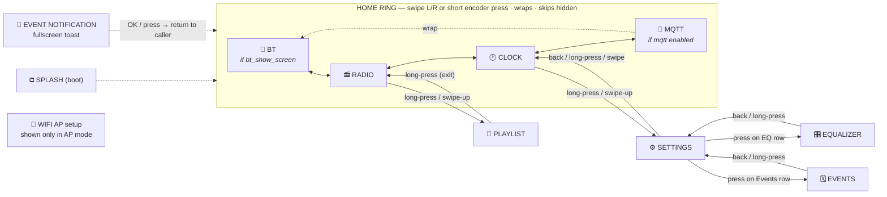

# Navigation — screens, the home ring, and inputs

How the user moves between screens with the **encoder** and **touch**. There
are two layers:

- **Home ring** — the screens you cycle through with a swipe or a short encoder
  press. Order and visibility live in one table, [`s_ring[]`](../components/ui/ui_nav.c),
  so the ring is the single place to edit when adding/removing/reordering a home
  screen. Hidden entries are skipped automatically.
- **Sub-screens** (playlist, settings, EQ, events) — reached from a parent via a
  long-press or swipe-up, exited with back / long-press. These keep their own
  parent↔back navigation inside each screen's `on_input`.

## Map



## Inputs per home screen

| Input | RADIO | CLOCK | BT | MQTT |
|---|---|---|---|---|
| Encoder rotate (CW/CCW) | volume | volume (radio or BT) | BT volume | — (widgets are touch-only) |
| Encoder short press | ring → next | ring → next | ring → next | ring → next |
| Encoder long press | → PLAYLIST | → SETTINGS | toggle BT on/off | — |
| Swipe right | ring → next | ring → next | ring → next | ring → next |
| Swipe left | ring → prev | ring → prev | ring → prev | ring → prev |
| Swipe up | → PLAYLIST | → SETTINGS | — | — |

`ring → next/prev` resolves through [`ui_nav_ring_next/prev`](../components/ui/ui_nav.c),
which skips hidden entries and wraps around. Short press and swipe-right are the
same direction, so the encoder and touch share one mental model.

## Visibility conditions

A ring entry shows only when its condition holds; otherwise it is skipped (both
by the encoder cycle and by swipe):

| Screen | Condition | Source |
|---|---|---|
| RADIO | always | — |
| CLOCK | always | — |
| BT | `bt_show_screen` | [app_state](../components/app_state/app_state.h) (Settings → BT screen) |
| MQTT | `enabled` | [mqtt_config](../components/mqtt_svc/mqtt_config.h) (MQTT configured/on) |

When MQTT is disabled the ring is effectively `BT — RADIO — CLOCK` and still
wraps; no dead ends.

## Editing the map

To add, remove, or reorder a home screen, edit only the table in
[components/ui/ui_nav.c](../components/ui/ui_nav.c):

```c
static const nav_ring_entry_t s_ring[] = {
    { SCREEN_BT,    cond_bt_screen    },   // visible only if bt_show_screen
    { SCREEN_RADIO, NULL              },   // always visible
    { SCREEN_CLOCK, NULL              },   // always visible
    { SCREEN_MQTT,  cond_mqtt_enabled },   // visible only if mqtt enabled
};
```

- **Order** in the array = the swipe / press order (it wraps).
- **`visible`** is a predicate; `NULL` means always shown. Add a new
  `cond_*` function to gate a screen on any runtime flag.
- The screen still needs its `on_input` to delegate ring moves
  (`ui_nav_ring_next/prev(SCREEN_X)`); copy the pattern from an existing home
  screen.

Sub-screen (modal) transitions are **not** in this table — they live in each
screen's `on_input` (e.g. [screen_settings.c](../components/ui/screens/screen_settings.c)
drilling into EQ/Events). Keep this document in sync when either changes.
