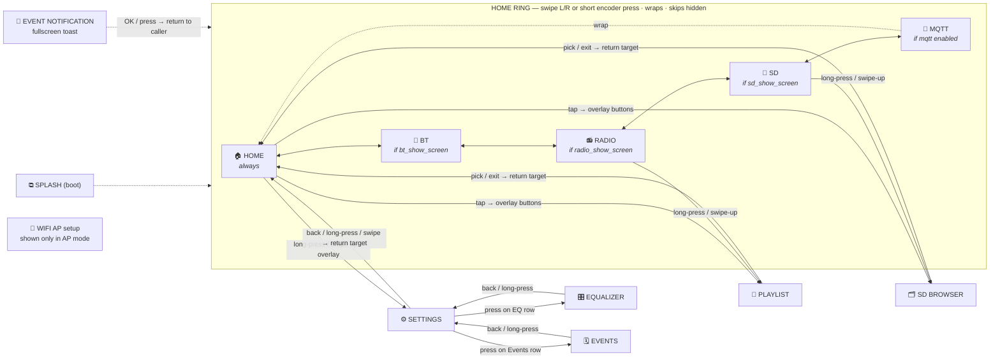

# Navigation — screens, the home ring, and inputs

How the user moves between screens with the **encoder** and **touch**. There
are two layers:

- **Home ring** — the screens you cycle through with a swipe or a short encoder
  press. Order and visibility live in one table, [`s_ring[]`](../components/ui/ui_nav.c),
  so the ring is the single place to edit when adding/removing/reordering a home
  screen. Hidden entries are skipped automatically.
- **Sub-screens** (playlist, SD browser, settings, EQ, events) — reached from a
  parent via a long-press or swipe-up, exited with back / long-press. These keep
  their own parent↔back navigation inside each screen's `on_input`.

## The Home hub

`SCREEN_HOME` is the default screen and the first ring entry. It is a clock face
(time / date / now-playing strip) that **adapts to the active source** (radio /
SD / BT), plus a tap-to-show, auto-hiding overlay — `hub_overlay_widget` — with
two rows of buttons:

- **transport** (source-aware): `vol-  prev  play/stop  next  vol+`
- **actions**: `source` (toggles BT as the audio source), `playlist`,
  `sd` (browser), `settings`

The hub fully supersedes the old standalone clock screen, which was removed
(`SCREEN_CLOCK` is kept only as a tombstone enum value; a persisted
`display.screen == clock` is migrated to Home on load).

## Map



## Inputs per home screen

| Input | HOME | RADIO | SD | BT | MQTT |
|---|---|---|---|---|---|
| Encoder rotate (CW/CCW) | volume (radio or BT) | volume | volume | BT volume | — (widgets are touch-only) |
| Encoder short press | ring → next | ring → next | ring → next | ring → next | ring → next |
| Encoder long press | → SETTINGS | → PLAYLIST | → SD BROWSER | toggle BT on/off | — |
| Swipe right | ring → next | ring → next | ring → next | ring → next | ring → next |
| Swipe left | ring → prev | ring → prev | ring → prev | ring → prev | ring → prev |
| Swipe up | → SETTINGS | → PLAYLIST | → SD BROWSER | — | — |
| Tap (touch) | overlay: transport + source/playlist/sd/settings | overlay: transport (radio) | overlay: transport (SD) | overlay: transport (BT) | — |

`ring → next/prev` resolves through [`ui_nav_ring_next/prev`](../components/ui/ui_nav.c),
which skips hidden entries and wraps around. Short press and swipe-right are the
same direction, so the encoder and touch share one mental model.

The transport/play controls come from the tap-to-show overlays:
[`hub_overlay_widget`](../components/ui/widgets/hub_overlay_widget.c) on HOME (with
the extra source/playlist/sd/settings actions) and
[`controls_overlay_widget`](../components/ui/widgets/controls_overlay_widget.c) on
RADIO/SD/BT. Both auto-hide after a short timeout.

## Visibility conditions

A ring entry shows only when its condition holds; otherwise it is skipped (both
by the encoder cycle and by swipe):

| Screen | Condition | Source |
|---|---|---|
| HOME | always | — |
| RADIO | `radio_show_screen` | [app_state](../components/app_state/app_state.h) (Settings → Display) |
| SD | `sd_show_screen` | [app_state](../components/app_state/app_state.h) (Settings → Display) |
| BT | `bt_show_screen` | [app_state](../components/app_state/app_state.h) (Settings → BT screen) |
| MQTT | `enabled` | [mqtt_config](../components/mqtt_svc/mqtt_config.h) (MQTT configured/on) |

HOME is always visible, so the ring can never be empty — hide every other screen
and you still have a working hub.

## Return targets for sub-screens

The playlist, SD browser, and settings screens navigate back to a **settable
return screen** instead of a hard-coded one, so picking a station/track or
leaving settings lands you where you came from:

- opened from a source screen → returns to that screen (RADIO / SD / CLOCK→HOME),
- opened from the Home hub's overlay → returns to **HOME**.

The opener sets it before navigating (`screen_playlist_set_return` /
`screen_sd_browser_set_return` / `screen_settings_set_return`). Sub-screens that
bounce back into settings (EQ, events) must **not** set it, so the original
opener's value survives the round-trip.

## Editing the map

To add, remove, or reorder a home screen, edit only the table in
[components/ui/ui_nav.c](../components/ui/ui_nav.c):

```c
static const nav_ring_entry_t s_ring[] = {
    { SCREEN_HOME,  NULL              },   // always visible — the unified hub
    { SCREEN_BT,    cond_bt_screen    },   // visible only if bt_show_screen
    { SCREEN_RADIO, cond_radio_screen },   // visible only if radio_show_screen
    { SCREEN_SD,    cond_sd_screen    },   // visible only if sd_show_screen
    { SCREEN_MQTT,  cond_mqtt_enabled },   // visible only if mqtt enabled
};
```

- **Order** in the array = the swipe / press order (it wraps).
- **`visible`** is a predicate; `NULL` means always shown. Add a new
  `cond_*` function to gate a screen on any runtime flag.
- The screen still needs its `on_input` to delegate ring moves
  (`ui_nav_ring_next/prev(SCREEN_X)`); copy the pattern from an existing home
  screen.

Sub-screen (modal) transitions are **not** in this table — they live in each
screen's `on_input` (e.g. [screen_settings.c](../components/ui/screens/screen_settings.c)
drilling into EQ/Events). Keep this document in sync when either changes.
